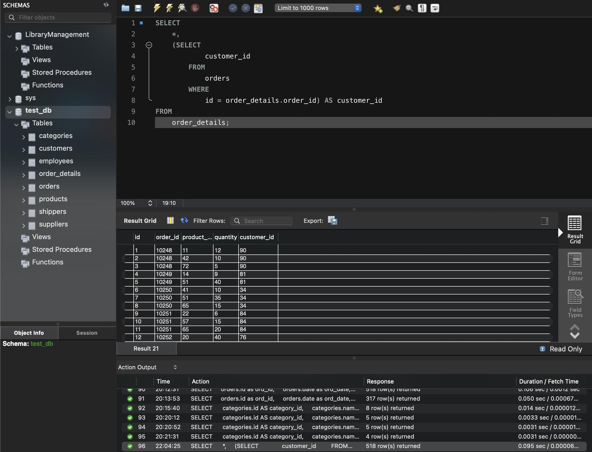
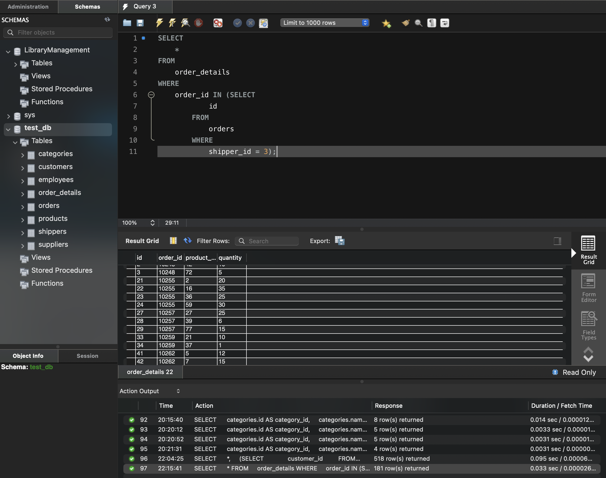
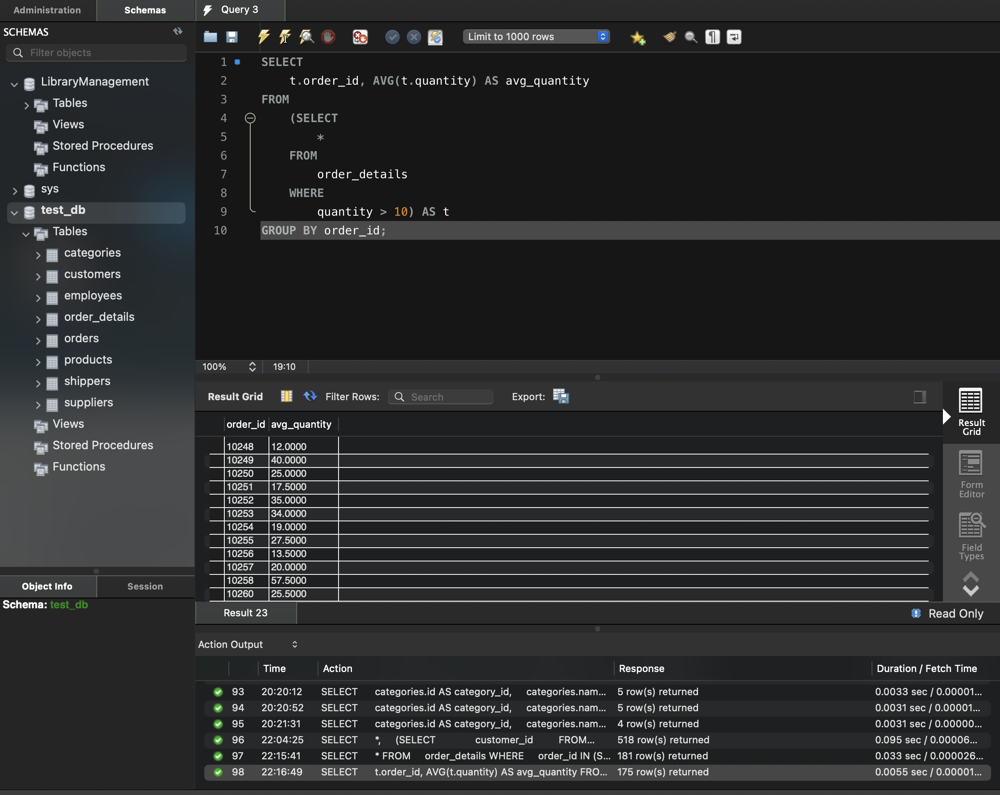
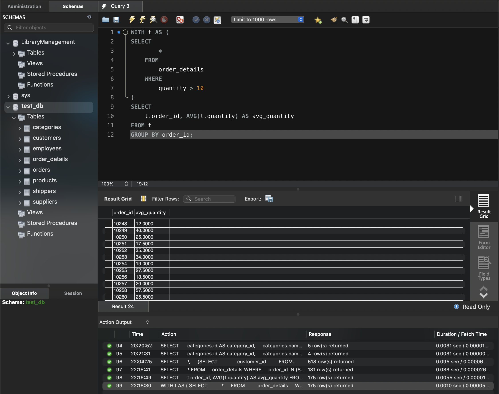
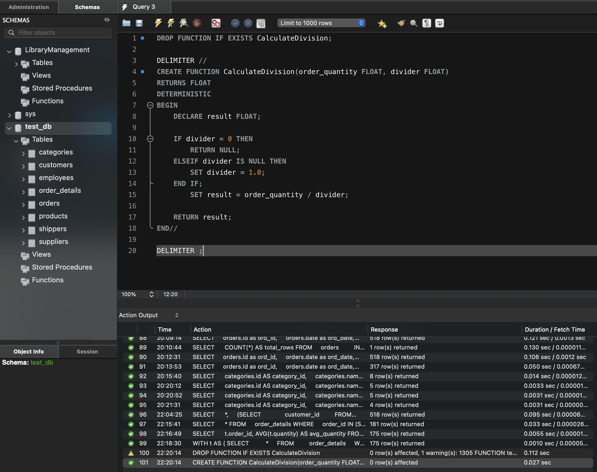
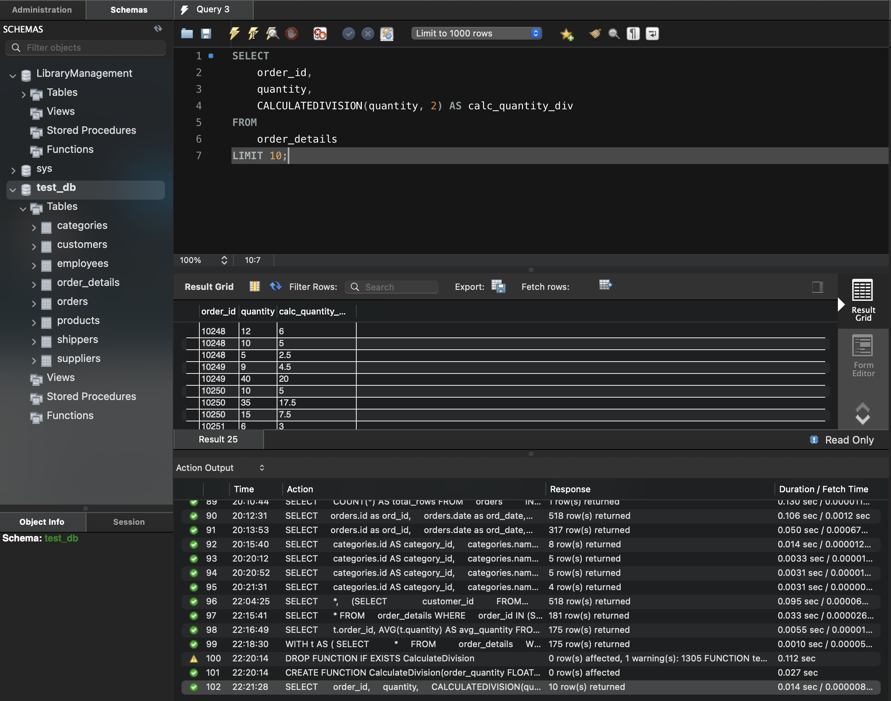
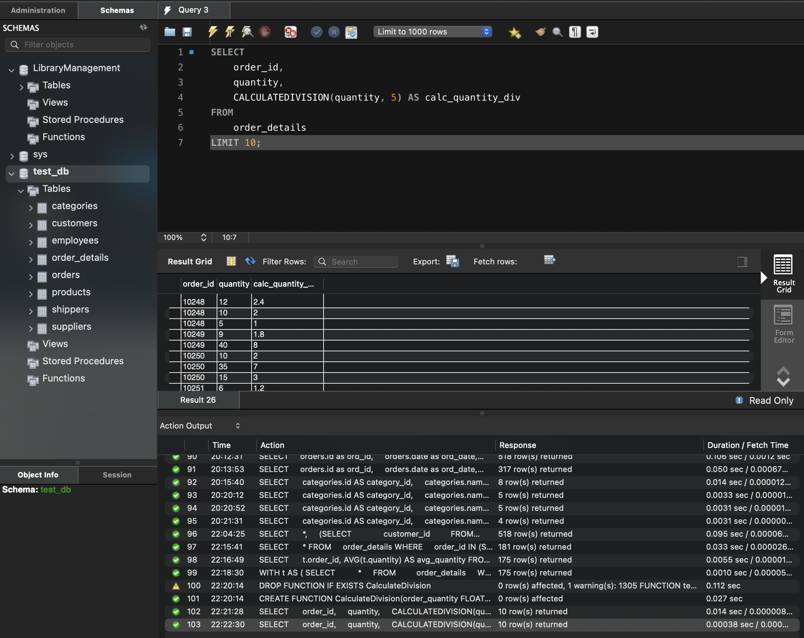

# Tasks

### task-01
Напишіть SQL запит, який буде відображати таблицю `order_details` та поле `customer_id` з таблиці `orders` відповідно для кожного поля запису з таблиці `order_details`.

Це має бути зроблено за допомогою вкладеного запиту в операторі `SELECT`.

```sql
USE test_db;

SELECT 
    *,
    (SELECT 
            customer_id
        FROM
            orders
        WHERE
            id = order_details.order_id) AS customer_id
FROM
    order_details;
```



### task-02 
Напишіть SQL запит, який буде відображати таблицю `order_details`. Відфільтруйте результати так, щоб відповідний запис із таблиці `orders` виконував умову `shipper_id=3`.

Це має бути зроблено за допомогою вкладеного запиту в операторі `WHERE`.

```sql
SELECT 
    *
FROM
    order_details
WHERE
    order_id IN (SELECT 
            id
        FROM
            orders
        WHERE
            shipper_id = 3);
```



### task-03. 
Напишіть SQL запит, вкладений в операторі `FROM`, який буде обирати рядки з умовою `quantity>10` з таблиці `order_details`. Для отриманих даних знайдіть середнє значення поля `quantity` — групувати слід за `order_id`.

```sql
SELECT 
    t.order_id, AVG(t.quantity) AS avg_quantity
FROM
    (SELECT 
        *
    FROM
        order_details
    WHERE
        quantity > 10) AS t
GROUP BY order_id;
```



### task-04.
Розв’яжіть завдання 3, використовуючи оператор `WITH` для створення тимчасової таблиці `temp`. Якщо ваша версія MySQL більш рання, ніж 8.0, створіть цей запит за аналогією до того, як це зроблено в конспекті.

```sql
WITH t AS (
SELECT 
        *
    FROM
        order_details
    WHERE
        quantity > 10
)
SELECT 
    t.order_id, AVG(t.quantity) AS avg_quantity
FROM t
GROUP BY order_id;
```



### task-05.
Створіть функцію з двома параметрами, яка буде ділити перший параметр на другий. Обидва параметри та значення, що повертається, повинні мати тип `FLOAT`.

Використайте конструкцію `DROP FUNCTION IF EXISTS`. Застосуйте функцію до атрибута `quantity` таблиці `order_details` . Другим параметром може бути довільне число на ваш розсуд.

```sql
DROP FUNCTION IF EXISTS CalculateDivision;

DELIMITER //
CREATE FUNCTION CalculateDivision(order_quantity FLOAT, divider FLOAT)
RETURNS FLOAT
DETERMINISTIC
BEGIN
	DECLARE result FLOAT;

	IF divider = 0 THEN
		RETURN NULL;
    ELSEIF divider IS NULL THEN
		SET divider = 1.0;
	END IF;
		SET result = order_quantity / divider;

    RETURN result;
END//

DELIMITER ;
```



Call a function:

```sql
SELECT 
    order_id,
    quantity,
    CALCULATEDIVISION(quantity, 2) AS calc_quantity_div
FROM
    order_details
LIMIT 10;
```




```sql
SELECT 
    order_id,
    quantity,
    CALCULATEDIVISION(quantity, 5) AS calc_quantity_div
FROM
    order_details
LIMIT 10;
```


